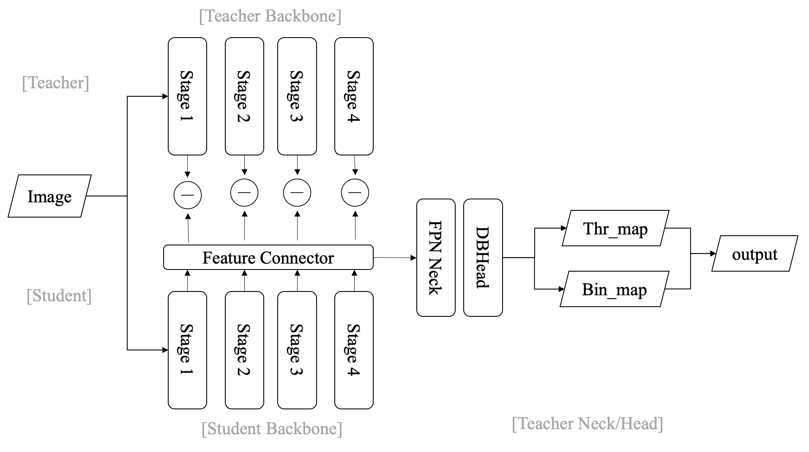

# TritonOCR

A multilingual and practical OCR tool for Shopee images based on [PyTorch](https://pytorch.org/)

- [TritonOCR](#tritonocr)
  - [1. Installation](#1-installation)
  - [2. Recognition](#2-recognition)
    - [2.1 Model architecture](#21-model-architecture)
    - [2.2 Training](#22-training)
      - [2.2.1 Data Preparation](#221-data-preparation)
      - [2.2.2 Start Training](#222-start-training)
      - [2.2.3 Convert PaddleOCR model into PyTorch/ONNX/TensorRT](#223-convert-paddleocr-model-into-pytorchonnxtensorrt)
  - [3. Detection](#3-detection)
    - [3.1 Training](#31-training)
  - [4. Inference](#4-inference)
  - [TODO](#todo)

## 1. Installation

1. PytTorch https://pytorch.org/get-started/previous-versions/  
version >= 1.10, for example, version 1.10.1 with CUDA 11.1:   
`pip install torch==1.10.1+cu111 torchvision==0.11.2+cu111 torchaudio==0.10.1 -f https://download.pytorch.org/whl/torch_stable.html`

2. PaddlePaddle https://www.paddlepaddle.org.cn/  
Optional, install it if you need to load weights from [PPOCR](https://github.com/PaddlePaddle/PaddleOCR)  
For example, version 2.3.1 with CUDA 11.1:  
`pip install paddlepaddle-gpu==2.3.1.post111 -f https://www.paddlepaddle.org.cn/whl/linux/mkl/avx/stable.html`  

1. TensorRT   
Optional, install it if you need convert to tensorRT  
Download install file from https://developer.nvidia.com/nvidia-tensorrt-download  
`pip install TensorRT-8.2.5.1/python/tensorrt-8.2.5.1-cp38-none-linux_x86_64.whl`  

1. Other packages  
`pip install -r requirements.txt`  

## 2. Recognition

### 2.1 Model architecture


### 2.2 Training
#### 2.2.1 Data Preparation

DataSet Preparation:

It is recommended to put the training images in the same folder, and use a txt file (rec_gt_train.txt) to store the image path and label. The contents of the txt file are as follows:

* Note: by default, the image path and image label are split with \t, if you use other methods to split, it will cause training error

```
" Image file name           Image annotation "
train_data/rec/train/word_001.jpg   简单可依赖
train_data/rec/train/word_002.jpg   用科技让复杂的世界更简单
...
```

Dictionary:

A dictionary ({word_dict_name}.txt) needs to be provided so that when the model is trained, all the characters that appear can be mapped to the dictionary index.

Therefore, the dictionary needs to contain all the characters that you want to be recognized correctly. {word_dict_name}.txt needs to be written in the following format and saved in the `utf-8` encoding format:

```
l
d
a
d
r
n
```

In `word_dict.txt`, there is a single word in each line, which maps characters and numeric indexes together, e.g "and" will be mapped to [2 5 1]

We provide some built-in dictionaries, which can be used on demand.

`ptocr/dict/cn_char.txt` is a Chinese dictionary.

`ptocr/dict/en_char.txt` is an English dictionary.

`ptocr/dict/th_char.txt` is a Thai dictionary.

`ptocr/dict/vn_char.txt` is a Vietnamese dictionary.

`ptocr/dict/pt_es_char.txt` is a Portuguese&Spanish dictionary.

#### 2.2.2 Start Training  
First modify the config file to set the dataset, dictionary or some other settings. Then run:
```
python tools/train.py -c configs/rec/rec_mobile_svtr_dml.yml
```

You can also download the [trained model](models/) to finetune on your own data:
```
python tools/train.py -c configs/rec/rec_mobile_svtr_dml.yml -o Global.pretrained_model=models/rec/rec_v3_mobile_dis_cn/best_accuracy
```
#### 2.2.3 Convert PaddleOCR model into PyTorch/ONNX/TensorRT
(Currently only support PaddleOCR v3 reconition model)  
If you want to convert model weigets in PaddleOCR, use [convert/convert_rec_v3.py](convert/convert_rec_v3.py) to convert into your target.  
If using Pytorch, can run [tools/infer_rec.py](tools/infer_rec.py) for inference:

```python
python tools/infer_rec.py 
-c convert/rec_v3_model.yml -o 
Global.pretrained_model='your torch model path'
Global.infer_img='your image dir'
Global.character_dict_path='your character dict path'
Global.save_res_path='your output file'
```

## 3. Detection

### 3.1 Training
1. Train a single model or use [DML](https://arxiv.org/pdf/1706.00384.pdf) training to get a teacher model (with backbone pretrained weights):  
`python tools/train.py -c configs/det/det_resnet_db_dml.yml -o Architecture.Models.Student.pretrained=./pretrain_models/ResNet50_vd_ssld_pretrained.pdparams Architecture.Models.Student2.pretrained=./pretrain_models/ResNet50_vd_ssld_pretrained.pdparams`  
1. Use teacher model and lightweight student model (with backbone pretrained weights) for [CML](https://arxiv.org/pdf/2109.03144.pdf) training:  
`python tools/train.py -c configs/det/det_resnet_db_dml.yml -o Architecture.Models.Student.pretrained=./pretrain_models/MobileNetV3_large_x0_5_pretrained.pdparams Architecture.Models.Student2.pretrained=./pretrain_models/MobileNetV3_large_x0_5_pretrained.pdparams Architecture.Models.Teacher.pretrained=./pretrain_models/dml_teacher`

### 3.2 Distillation Model

## 4. Inference 
Refer to [Model Inference](infer/)

## TODO 
Recognition  
- [ ] Language model integration 
- [ ] SVTR implementation 
- [x] Training with AMP
- [x] Distributed training
- [x] Modify rec metric to eval different languages
- [x] Recognition training pipeline with distillation
- [x] Recognition training pipeline
- [x] Onnx and tensorRT conversion
- [x] Recognition inference pipeline and loading PPOCR pretrained weights
- [x] PPOCRv3 recognition model to pytorch

Detection
- [x] Detection inference and training pipeline
- [x] PPOCRv3 detection model to pytorch